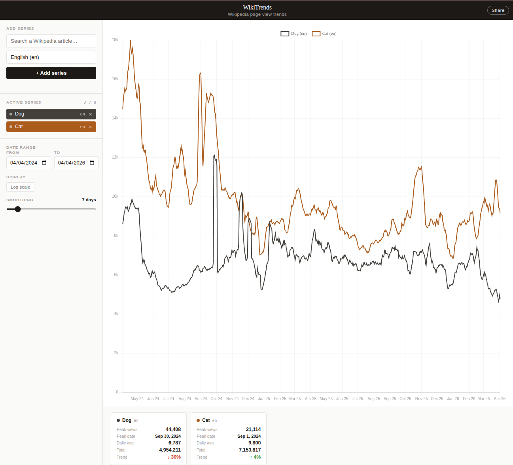
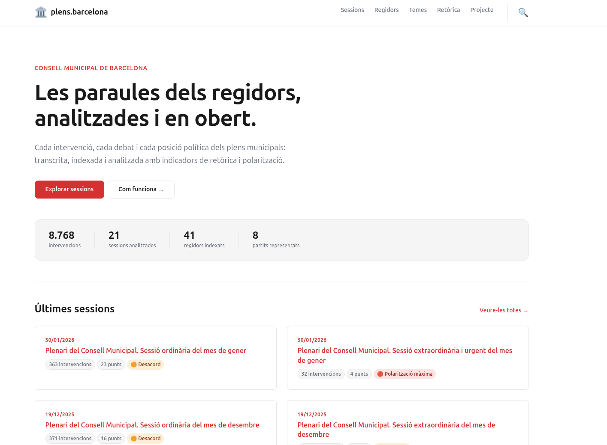
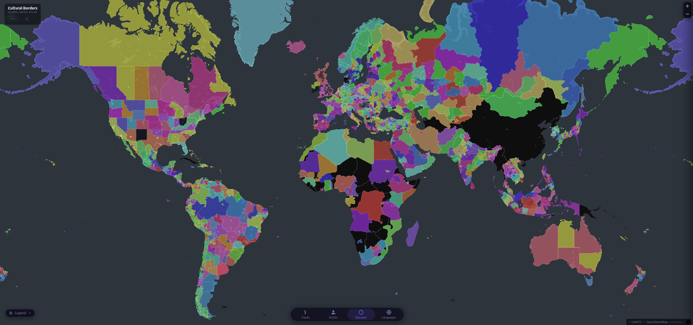
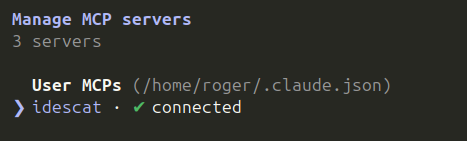

# Roger Sanjaume i Calvet
### Data Engineering & Analytics · Digital Humanities

Sóc analista de dades, entusiasta de l'explotació de dades per a l'anàlisi social i cultural. Actualment combino la meva tasca a **Som Energia**, desenvolupant pipelines per a grans volums de dades, amb la consultoria en projectes d'**humanitats digitals**.

 

## Projectes / Idees

Alguns dels _side projects_ que he fet últimament.

| Projecte | Descripció | Preview |
| :--- | :--- | :--- |
| **[WikiTrends](https://catbru.github.io/WikiTrends/)** | Comparativa de l'historial de visites d'articles de la Viquipèdia entre diferents idiomes i edicions. |  |
| **[Plens.Barcelona](http://plens.barcelona/)** | Transcripció i anàlisi de polarització i retòrica de cada intervenció dels plens municipals de Barcelona. |  |
| **[Youtube Music Atlas](https://catbru.github.io/cultural-borders-yt-charts-web/)** | Mapa mundial interactiu que visualitza fronteres culturals a través de les llistes d'èxits de YouTube Music. |  |
| **[Idescat MCP](https://github.com/catbru/idescat-mcp)** | Paquet per a agents d'IA (com Claude Code) per explotar l'API de l'Idescat de forma nativa. |  |

## Recerca i Col·laboracions
He participat com a assistent de recerca en anàlisi de dades per a institucions com la **UB**, la **UOC**. Especialitzat en obtenció, anàlisi i visualització de dades en ciències socials.

## Contacte
- **Web:** [rogersanjaume.cat](https://rogersanjaume.cat)
- **LinkedIn:** [in/roger-sanjaume-i-calvet](https://www.linkedin.com/in/roger-sanjaume-i-calvet-bb83ba100/)
- **Email:** rogersanjaume [at] proton [dot] me
